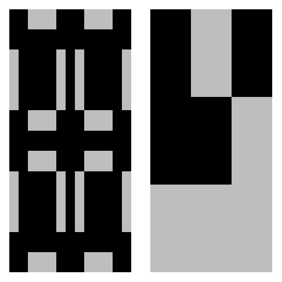

<!-- README.md is generated from README.Rmd. Please edit that file -->

# conwaysGoL

<!-- badges: start -->

<!-- badges: end -->

The goal of `conwaysGoL` is to provide an easy-to-handle package to
explore artificial life using the Conway’s Game of Life. The package
allows to run simulations in a toroidal grid of any size for a desired
number of generations. Users can save their simulations as a succession
of frames and/or as GIFs. The package comes with a library of some
common patterns that can be used freely during their simulations. This
library can be enriched by the users and stored patterns can be used
indefinitely across R sessions. Finally, users can easily convert
Run-Length Encoding (RLE) files (from <https://copy.sh/life/> for
example) into binary (0,1) matrices compatible with the package
functions.

## Installation

You can install the development version of `conwaysGoL` from
[GitHub](https://github.com/) with:

``` r
install.packages("remotes")
remotes::install_url(
  "https://github.com/LucasDLalande/conwaysGoL/archive/refs/heads/master.zip"
)
```

## Usage and examples

Load the package:

``` r
library(conwaysGoL)
```

This is a basic example which shows how to run a simple simulation:

``` r
# runs a simple simulation on a randomly generated grid (living cells: 30%, 100x100, 20 generations)
gameoflife(nrow = 100,
ncol = 100,
generations = 20,
p = 0.3)
```

Users can also run a simulation initiated with some of the built-in
patterns:

``` r
library(conwaysGoL)
# runs a simulation starting with a glider (initial position: (10,10)) and a Gosper glider gun (initial position: (60, 60)), rotated clockwise, in an empty grid
gameoflife(nrow = 100,
ncol = 100,
generations = 50,
pattern = c("glider", "gosper_gun"),
pos.row = c(10, 60),
pos.col = c(10, 60),
rotation = 90)
```

By setting `record = TRUE`, users can save their simulation as GIF file
in desired directory:

``` r
gameoflife(nrow = 100,
ncol = 100,
generations = 50,
pattern = c("glider", "gosper_gun"),
pos.row = c(10, 60),
pos.col = c(10, 60),
rotation = 90,
record = TRUE,
frames_prefix = "gosper_glider",
zero_padding = 3,
gif_name = "gosper_glider.gif",
output_path = "animations/")
```

Users can visualize binary (0,1) matrices and built-in patterns using
the `plot_grid()` function:

``` r
# direct matrix
glider <- matrix(c(0,1,0,
0,0,1,
1,1,1),
nrow = 3,
byrow = TRUE)

plot_grid(glider)
```


``` r
# built-in matrix
plot_grid("pulsar")
```


``` r
# multiple patterns
glider <- matrix(c(0,1,0,
0,0,1,
1,1,1),
nrow = 3,
byrow = TRUE)

plot_grid(list("pulsar", glider))
```



The list of built-in patterns is accessible using the `list_patterns()`
function:

``` r
list_patterns()
#>  [1] "beacon"         "beehive"        "blinker"        "block"         
#>  [5] "boat"           "glider"         "gosper_gun"     "HWSS"          
#>  [9] "loaf"           "LWSS"           "MWSS"           "pentadecathlon"
#> [13] "pulsar"         "random"         "toad"           "tub"
```

If users are interested in a specific structure of the Conway’s Game of
Life, they can download a RLE file of the structure and convert it to a
binary matrix compatible with the package using the `read_rle()`
function. To do so, simply fill the function with the absolute or
relative path to the downloaded .rle file.

Finally, users can enrich the built-in pattern library with their own
patterns (either written as binary matrices, or converted from .rle
files):

``` r
# temporary add a pattern built by the user
pattern <- matrix(
c(1,0,0,
1,1,1,
0,0,1),
nrow = 3,
byrow = TRUE)

add_pattern("my_own_pattern", pattern)

# permanently add a pattern extracted from a .rle file
cordership <- read_rle("patterns/cordership.rle")

add_pattern("cordership", cordership, permanent = TRUE)
```

## License

This package is under the MIT License.

## Citation

To cite the `conwaysGoL` package in your publications, please use:

Lalande LD (2026). *conwaysGoL: An easy-to-handle Conway’s Game of Life
simulator for R*. R package version 1.0.0,
<https://github.com/LucasDLalande/conwaysGoL.git>.
